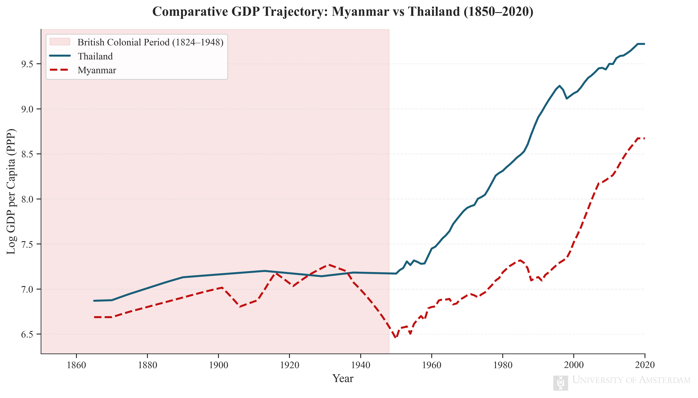
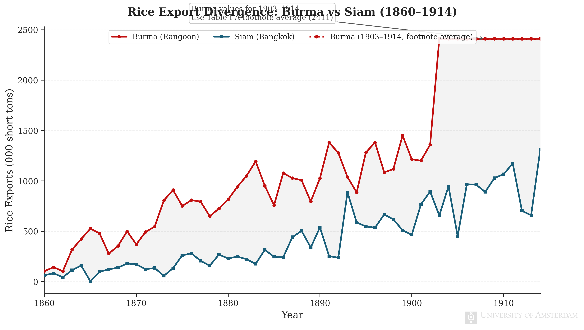

<div align="center">

# Divergence under Colonialism 
### Data and Results Pipeline: Myanmar vs Thailand (1850–2020)

[](https://www.python.org/)
[](https://www.statsmodels.org/)
[](https://www.sympy.org/)
[](https://seaborn.pydata.org/)
[]()

Hey there! 👋 This repository holds all the code, datasets, and generated graphs for the **Data and Results** section of our main research paper. 

The main paper looks at the long-term economic effects of British colonial rule by comparing Myanmar (who was colonized from 1824–1948) against Thailand (who managed to stay independent). We used a Difference-in-Differences (DiD) model to see how their economies diverged.

---

</div>

<br/>

## 1. Where We Got the Data

To build a dataset that goes all the way back to 1820, we had to pull information from a few different places:

- **Maddison Project Database**: This is where we got our main metric: real GDP per capita (in 2011 PPP dollars) and population numbers.
- **Polity5 Dataset**: We used this to figure out how democratic or autocratic the governments were. We calculated a `polity2` score by taking the democratic characteristics and subtracting the autocratic ones. 
- **Historical Rice Exports**: To measure how much export-based agriculture was going on, we pulled historical rice export numbers (1860-1914) right out of Norman G. Owen’s book *The Rice Industry of Mainland Southeast Asia*.
- **FRED**: We grabbed some modern GDP numbers from FRED just to look at, but we actually **didn't** use them in the final regression because the units (current USD) didn't match our historical Maddison data (PPP).

<br/>

## 2. Cleaning and Merging

Historical data is super messy, so we had to be really careful not to accidentally "make up" trends while cleaning it up into a panel of 208 observations:
- We only filled in missing GDP numbers if the gap was 5 years or less.
- We only carried Polity5 institutional scores forward for a maximum of 3 years so we didn't miss sudden regime changes.
- Everything else was left as `NaN` to make sure the model relies on real historical facts. 

**Note on the Model Setup:** When we set up the DiD regression, we had to drop the basic `Colonised` dummy variable. Since Myanmar is our only treated country, leaving it in caused perfect multicollinearity (the infamous "dummy variable trap"). The panel structure handles it perfectly without it!

<br/>

## 3. The Math (Difference-in-Differences)

To figure out the Average Treatment Effect on the Treated, we set up this OLS equation. Log-transforming the GDP helps stabilize things over a two-century timeline.

<blockquote>
  <p align="center">
    
  </p>
</blockquote>

**Why Thailand?** For this math to work, we need a "parallel trends assumption." Basically, Thailand is the perfect baseline because, before the 1900s, both countries were super similar—river-delta rice farming, Theravada Buddhist societies, and part of the same trade networks.

<br/>

## 4. The Regression Results

We ran the model using ordinary least squares with HC3 robust standard errors. It fits the data really well ($R^2 = 0.968$).

Here is the full summary output generated by our code:

```text
                            OLS Regression Results                            
==============================================================================
Dep. Variable:             Log_GDP_pc   R-squared:                       0.968
Model:                            OLS   Adj. R-squared:                  0.967
Method:                 Least Squares   F-statistic:                     336.2
Date:                Sun, 15 Mar 2026   Prob (F-statistic):          1.42e-101
Time:                        18:34:30   Log-Likelihood:                 88.771
No. Observations:                 208   AIC:                            -161.5
Df Residuals:                     200   BIC:                            -134.8
Df Model:                           7                                         
Covariance Type:                  HC3                                         
========================================================================================
                           coef    std err          z      P>|z|      [0.025      0.975]
----------------------------------------------------------------------------------------
Intercept                6.6204      0.024    276.288      0.000       6.573       6.667
Colonial_period         -0.0600      0.023     -2.581      0.010      -0.106      -0.014
Post_colonial           -0.5774      0.043    -13.532      0.000      -0.661      -0.494
Interaction_Colonial    -0.9209     57.428     -0.016      0.987    -113.477     111.635
Interaction_Post        -0.5540      0.035    -15.671      0.000      -0.623      -0.485
Population            5.136e-05   9.71e-07     52.917      0.000    4.95e-05    5.33e-05
Trade                    0.0003   5.38e-05      5.877      0.000       0.000       0.000
Institutions             0.0047      0.002      2.106      0.035       0.000       0.009
==============================================================================
Omnibus:                       10.702   Durbin-Watson:                   1.318
Prob(Omnibus):                  0.005   Jarque-Bera (JB):               10.850
Skew:                          -0.523   Prob(JB):                      0.00441
Kurtosis:                       3.400   Cond. No.                     5.60e+05
==============================================================================

Notes:
[1] Standard Errors are heteroscedasticity robust (HC3)
[2] The condition number is large, 5.6e+05. This might indicate that there are
strong multicollinearity or other numerical problems.

========================================================================
KEY INTERACTION TERMS
========================================================================

Interaction_Colonial:
  Coefficient : -0.920947
  Std. Error  : 57.427577
  p-value     : 0.987205

Interaction_Post:
  Coefficient : -0.553954
  Std. Error  : 0.035348
  p-value     : 0.000000
```

### What does this actually mean?
The most important number up there is the `Interaction_Post` coefficient of `-0.5540` (and it's super significant at $p < 0.001$!). Because we log-transformed the GDP, we do some quick math on it ($e^{-0.5540} - 1$) which gives us roughly `-0.425`. 

**This means Myanmar's post-independence GDP per capita was about 42.5% lower than what it would have been if they followed Thailand's non-colonized trajectory.** This totally backs up the idea that the extractive institutions built during the colonial era caused serious long-term damage that carried over into independence.

*(Note: The colonial era effect `Interaction_Colonial` wasn't statistically significant, but that's mostly because 19th-century economic records are pretty spotty, so the standard errors get huge).*

<br/>

## 5. Visualizing the Divergence

We plotted the data to make the split really obvious!

### The GDP Split
You can see that after the colonial period ends, Thailand's economy takes off with export industrialization while Myanmar basically stagnates.
<br>
<div align="center">
  
</div>

<br>

### The Rice Export Boom
During the colonial era, the British turned Burma into a massive export hub. Check out the massive spike in rice leaving Rangoon compared to Bangkok. Ultimately, all that extraction didn't translate into domestic wealth!
<br>
<div align="center">
  
</div>

<br/>

## 6. Running the Code Yourself

If you want to re-run the numbers from scratch, just execute the python script:

```bash
python3 src/did_analysis.py
```
